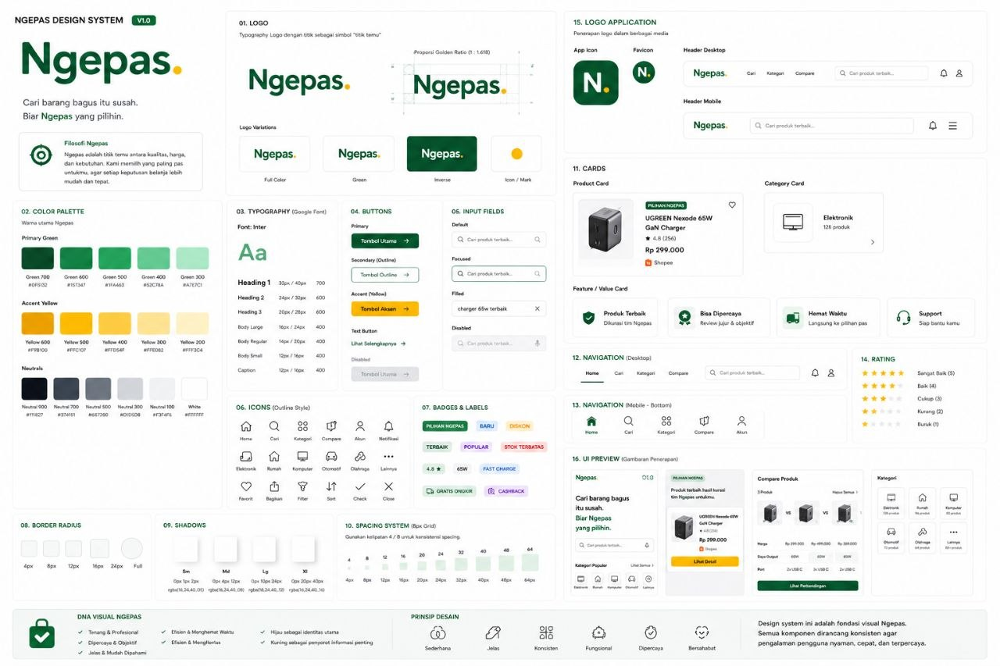
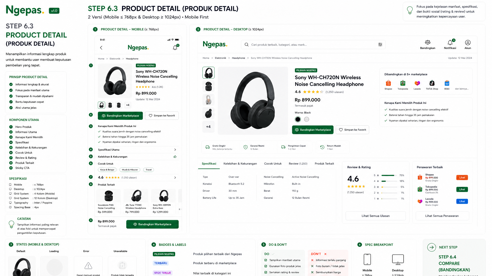
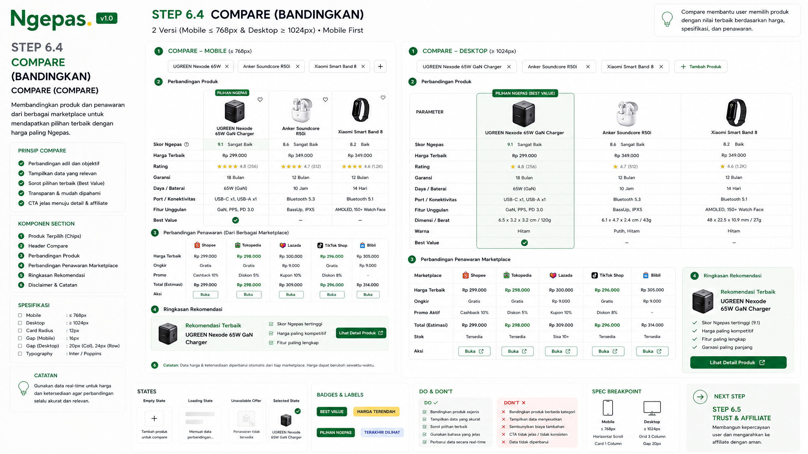
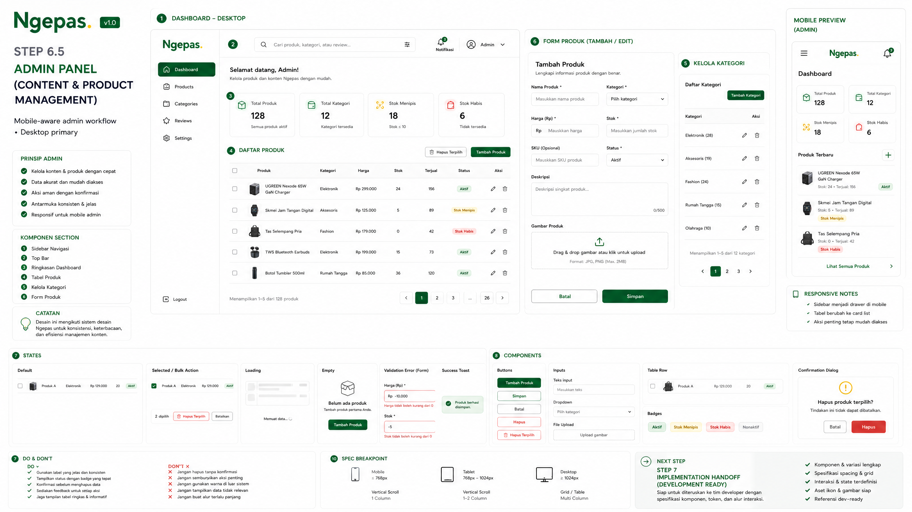

# Ngepas UI/UX System v1.1

| Field | Decision |
|---|---|
| Status | Draft — review tim |
| Branch | `design/uiux-system-v1.1` |
| Source of truth | Referensi visual tim Ngepas di `src/docs/assets/uiux-v1.1/reference/` |
| Scope | UI/UX documentation dan aset visual saja; tidak mengubah FE, BE, API, atau database |

## 1. Keputusan yang Tidak Diubah

Referensi visual tim menggantikan mockup lama Manus sebagai acuan utama. **Logo Ngepas, aksen titik kuning, typography, kombinasi hijau-kuning, icon outline, header, navigation, spacing, radius, dan gaya dokumentasi step-by-step sudah dianggap final.** Jangan mengganti identitas tersebut atau menambahkan gaya baru tanpa keputusan eksplisit tim.

Ngepas adalah platform kurasi dan pembantu keputusan belanja, bukan toko online dan bukan marketplace. User memahami produk di Ngepas, membandingkan pilihan, lalu berpindah ke marketplace untuk checkout.

> Prinsip kerja: **konsisten lebih penting daripada keren.** Jika komponen sudah ada di referensi, gunakan ulang. Jika belum ada, turunkan dari visual grammar yang sama: kanvas putih, hierarki hijau, aksen kuning secukupnya, garis tipis, whitespace, dan label yang jelas.

## 2. Flow Utama

```text
Discover → Search & Filter → Product Detail → Compare
→ Trust & Affiliate → Checkout di Marketplace
```

| Breakpoint | Kontrak |
|---|---|
| Mobile | ≤ 768px; satu kolom atau horizontal scroll terkontrol |
| Tablet | 769–1023px; transisi tanpa mengubah hierarki informasi |
| Desktop | ≥ 1024px; grid atau multi-column sesuai step |

## 3. Step yang Sudah Menjadi Referensi Tim

| Step | Section | Peran |
|---|---|---|
| 6.1.1 | Header Discover | Menu, search, filter, compare, notifikasi, akun |
| 6.1.2 | Hero / Value Proposition | Menjelaskan manfaat Ngepas secara singkat |
| 6.1.3 | Kategori Populer | Jalan cepat menuju kategori |
| 6.1.4 | Pilihan Ngepas | Produk terbaik hasil kurasi |
| 6.1.5 | Trending Minggu Ini | Produk yang sedang populer |
| 6.1.6 | Artikel & Tips | Edukasi keputusan pembelian |
| 6.1.7 | Why Ngepas | Alasan user mempercayai Ngepas |
| 6.1.8 | Akun | Profil, wishlist, riwayat, compare, pengaturan |
| 6.2 | Search & Filter | Query, kategori, harga, rating, lokasi/toko, urutan |

Urutan Discover dipertahankan: **Header → Hero → Kategori → Pilihan Ngepas → Trending → Artikel & Tips → Why Ngepas → Akun**. Section baru tidak boleh ditambahkan hanya untuk dekorasi atau mengulang fungsi yang sudah ada.

## 4. State yang Wajib Didokumentasikan

| Area | State minimum |
|---|---|
| Header | Default, search focus, menu open, notification open, account menu open |
| Search | Empty, query terisi, suggestion, filter aktif, loading, hasil kosong, error |
| Category | Default, hover desktop, active, disabled, loading |
| Product card | Default, favorite active, loading, unavailable, variasi badge |
| Product detail | Default, image loading, data error, penawaran kosong, affiliate feedback |
| Compare | Belum memilih produk, loading, produk terpilih, penawaran tidak tersedia |
| Account | Logged-in, wishlist kosong, history kosong, konfirmasi logout |
| Admin | Selected/bulk action, loading, empty, validation error, success toast |

## 5. Spesifikasi Tambahan yang Belum Ada

### Step 6.3 — Product Detail

Product Detail menjadi jembatan dari hasil pencarian menuju keputusan. Mobile menampilkan gallery, judul, rating, harga terakhir, timestamp pembaruan, badge Pilihan Ngepas, CTA **Bandingkan Marketplace**, favorite, alasan pemilihan, spesifikasi, kelebihan-kekurangan, cocok untuk, review, dan produk terkait. CTA utama menggunakan sticky bottom action agar mudah dijangkau. Desktop memakai hero dua kolom dengan informasi utama dan preview penawaran marketplace.

### Step 6.4 — Compare

Compare menerima dua atau tiga produk dari Search atau Product Detail. Parameter utama yang ditampilkan lebih dulu adalah Skor Ngepas, harga terbaik, rating, garansi, fitur utama, dimensi/berat jika tersedia, dan label **Best Value**. Spesifikasi tambahan dapat dikelompokkan agar tabel tidak terlalu panjang. Desktop menggunakan tabel dengan header produk yang tetap terlihat; mobile memakai horizontal scroll yang terkontrol.

Compare Marketplace menampilkan Shopee, Tokopedia, Lazada, TikTok Shop, dan Blibli dengan harga, ongkir, promo, total estimasi, stok, dan tombol **Buka**. Harga atau total terbaik boleh diberi penekanan visual sesuai token yang sudah ada, tanpa membuatnya terlihat seperti checkout di Ngepas.

### Step 6.5 — Trust & Affiliate

Sebelum perpindahan ke marketplace, Ngepas menampilkan alasan rekomendasi, sumber pembaruan harga, rating/review, marketplace yang dibandingkan, label Best Value, dan catatan bahwa harga dapat berubah. CTA affiliate harus menjelaskan bahwa user akan membuka marketplace; checkout tidak terjadi di Ngepas.

### Step 6.5 — Admin Panel

Admin menggunakan visual system yang sama dengan prioritas efisiensi. Desktop menjadi target utama dengan Dashboard, Products, Categories, Reviews, dan Settings. Komponen minimum: tabel produk, form tambah/edit, status, bulk action, pagination, confirmation dialog, validation error, loading, empty state, dan success toast. Pada mobile, sidebar menjadi drawer dan tabel dapat berubah menjadi card/list tanpa menghilangkan aksi utama.

## 6. Do & Don’t

| Do | Don’t |
|---|---|
| Gunakan referensi tim sebagai sumber kebenaran | Mengambil layout mockup lama tanpa review |
| Pertahankan logo, font, warna, icon, dan spacing | Mengubah identitas karena preferensi pribadi |
| Tampilkan manfaat, harga, rating, dan sumber data | Menyembunyikan informasi penting di balik dekorasi |
| Dokumentasikan loading, empty, error, dan disabled | Hanya membuat tampilan default |
| Gunakan satu CTA utama per tujuan | Menampilkan banyak CTA dengan bobot sama |
| Buat card ringkas dan mudah dipindai | Menjadikan seluruh halaman kumpulan card besar |

## 7. Batasan Implementasi

Dokumen ini tidak mengubah API, database, autentikasi, affiliate integration, atau arsitektur. Jika implementasi membutuhkan endpoint baru, buat pekerjaan terpisah dan ikuti alur resmi proyek:

```text
Component → Context → Service → API → Backend
```

Perubahan kode berikutnya dibuat di branch terpisah, diuji terlebih dahulu, lalu baru diajukan untuk merge ke `main`.

## 8. Aset

| Folder | Isi |
|---|---|
| `src/docs/assets/uiux-v1.1/reference/` | 18 gambar referensi asli dari user/tim, disimpan apa adanya |
| `src/docs/assets/uiux-v1.1/additional/` | Mockup Step 6.3 Product Detail, Step 6.4 Compare, dan Step 6.5 Admin yang dibuat mengikuti referensi tim |

### Peta file referensi utama

| File | Referensi |
|---|---|
| `1000702639.jpg` | Design System utama |
| `1000702670.jpg` | Hero / Value Proposition |
| `1000702671.jpg` | Header Discover |
| `1000702672.jpg` | Kategori Populer |
| `1000702673.jpg` | Pilihan Ngepas |
| `1000702674.jpg` | Trending Minggu Ini |
| `1000702676.jpg` | Artikel & Tips |
| `1000702677.jpg` | Why Ngepas |
| `1000702678.jpg` | Akun |
| `1000702679.jpg` | Search & Filter |
| `1000702632.jpg`–`1000702638.jpg`, `1000702640.jpg` | Referensi tambahan tim |

## 9. Review Checklist untuk Tim AI

Sebelum membuat atau mengubah UI, agent wajib membaca `ngepas-core.md`, dokumen ini, dan referensi visual yang relevan. Agent tidak boleh membuat ulang logo, mengganti typography, mengubah palette, atau menambahkan pola visual baru ketika komponen tersebut sudah tersedia. Untuk komponen yang belum ada, agent harus menjelaskan bahwa komponen itu merupakan tambahan turunan dari sistem yang sudah disetujui.

Karena product owner mengembangkan dari HP dan mulai dari nol, instruksi implementasi harus bertahap, menggunakan bahasa Indonesia sederhana, menyebut branch yang dipakai, dan selalu memisahkan proses review dari merge ke `main`.

## 10. Next Step

Review branch ini bersama tim AI. Jika disetujui, implementasi dimulai dari Header Discover, Hero, dan Search karena ketiganya dipakai lintas halaman. Setelah setiap step selesai, lakukan pengecekan mobile dan desktop, dokumentasikan keputusan, lalu ajukan pull request.

> **Status saat ini:** aset referensi sudah dimasukkan ke branch baru. Belum ada source code FE/BE yang diubah.

## Referensi Internal

[1]: `src/docs/docs/ngepas-core.md` — Ngepas Core
[2]: `src/docs/docs/coding-standard.md` — Coding Standard
[3]: `src/docs/docs/api-contract.md` — API Contract
[4]: `src/docs/assets/uiux-v1.1/reference/` — Referensi visual tim

<!-- Preview utama untuk pembaca repository -->









— Tim Ngepas

# END
